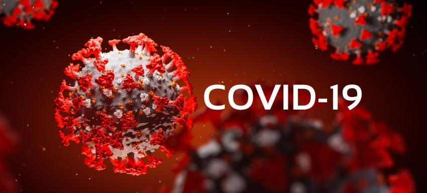

# Hospital Sírio-Libanês - Prevendo leitos de UTI para COVID-19
Por [Johnny Yamanaka](https://www.linkedin.com/in/johnny-yamanaka/)

## :telescope: Introdução
Desde o início da pandemia do novo corona vírus, essa doença vem sendo um desafio para todo o sistema de saúde. A falta de conhecimento sobre a doença, a alta taxa de contágio e a demora no desenvolvimento dos imunizantes fez com que os hospitais se vissem com uma demanda acima do esperado e, tanto serviços públicos como privados estiveram à beira do colapso.   
Diante desse cenário, os hospitais buscaram isolar os pacientes infectados por essa doença dos demais, criando alas específicas quando o a estrutura permitiram. E isso se aplica também às UTI's (Unidade de Terapia Intensiva), que necessita estar equipado de ventiladores mecânicos para manter a oxigenação do paciente.    
Mas diante de uma doença nova, que precisa de cuidados específicos, como provisionar recursos para atender todos os pacientes? É o que esse projeto tentará resolver. 

## :dart: Objetivo
Vamos mergulhar no conjunto de dataset do [hospital Sírio-Libanês](https://www.kaggle.com/S%C3%ADrio-Libanes/covid19) com dados de exames clínicos de pacientes que deram entrada com quadro de COVID-19 e desenvolver um modelo que para predizer se o paciente precisará ser internado na UTI ou não.

## :mag: Conteúdo  
A estrutura do projeto da seguinte forma:
* Pasta dados, contendo os dados originais, retirados do Kaggle e os dados tratados para análise e treinamento;
* Pasta contendo os notebooks:
  * [`limpeza-dos-dados.ipynb`](notebooks/limpeza-dos-dados.ipynb): seção que aborda a limpeza e tratamento dos dados;
  * [`analise-de-dados.ipynb`](notebooks/analise-de-dados.ipynb): seção com a análise exploratória dos dados tratados;
  * [`treinamento-modelo.ipynb`](notebooks/treinamento-modelo.ipynb): seção com o desenvolvimento dos modelos.

## :wrench: Desenvolvimento do Modelo  
### :floppy_disk: Modelos  
Para esse projeto selecionamos três modelos diferentes para testarmos: 
* SVC (Supported Vector Machine);
* Regressão Logística;
* Random Forest.

São três modelos com características diferentes, então vai nos dar um leque bom de opção para o modelo final. 

### :bar_chart: Métricas de Avaliação
Para avaliar o desempenho dos modelos desenvolvidos, foram escolhidas duas métricas, com a importância na seguinte ordem:
* AUC (Area Under the Curve): métrica derivada da ROC (receiver operating characteristic curve) que nos ajuda a entender o quão bom é o nosso modelo para diferenciar as duas classes;
* Recall: mede o quão bem o nosso modelo consegue identificar as classes positivas, tentando diminuir assim os falso negativo (erro tipo II).

Vamos repetir o teste 10 vezes através da validação cruzada e pegar a média das métricas citadas acima para avaliar o desempenho do modelo.

### :checkered_flag: Performance
O desempenho dos modelos finais, bem como a classificação foram:

| **#** | **modelo**          | **auc_medio** | **intervalo_auc** | **recall_medio** | **intervalo_recall** |
|------:|---------------------|---------------|-------------------|------------------|----------------------|
|     1 | SVC - grid          | 0.765480      | 0.628 - 0.903     | 0.664706         | 0.418 - 0.912        |
|     2 | Reg Log - Grid      | 0.765480      | 0.628 - 0.903     | 0.623529         | 0.334 - 0.913        |
|     3 | RandomForest - grid | 0.762384      | 0.610 - 0.914     | 0.523529         | 0.317 - 0.730        |

## :bulb: Resultado e Próximos Passos
O modelo desenvolvido ainda não está performando bem suficiente para ser colocado em produção, na realidade com um intervalo de confiança com uma variação tão grande nas duas métricas não podemos afirmar se ele está bem ou não. Uma das hipóteses é que, com um dataset pequeno (353 pacientes) os nossos modelos não foi capaz de generalizar bem e entregar um resultado consistente, portanto seria interessante agregar mais dados para assim podemos avaliar melhor.  
Outro ponto que pode afetar o nosso modelo - e que não foi explorado nesse projeto, é o feature engineering. Grande parte das features do dataset são oriundas dessa técnica, aplicada pela própria equipe de dados do hospital, mas dada o baixo desempenho, investigar mais e tentar criar novas fetures pode trazer melhores resultados.  
E por fim a forma que lidamos com a limpeza dos dados pode ter afetado o resultado. Lembrando: selecionamos somente a primeira janela (0-2) por paciente e, caso os valores fossem nulos, fazia um preenchimento com os dados do próprio paciente, só que das janelas posteriores. Avaliar outras formas de preenchimento desses dados vazios pode ser interessante. 
Olhando para o intervalo de confiança, podemos ver que o modelo ainda possui grande margem para melhoria e por isso vale a pena trabalhar nesse projeto.
